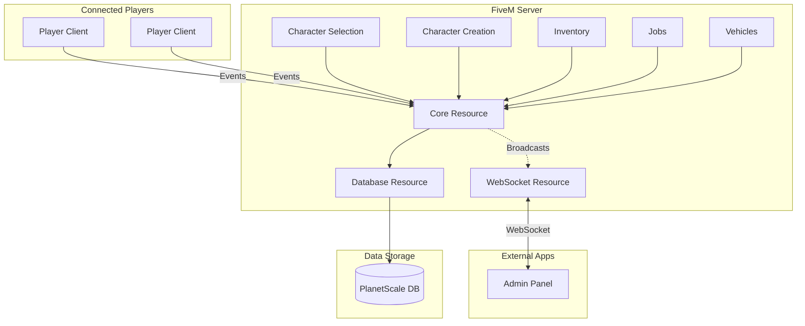
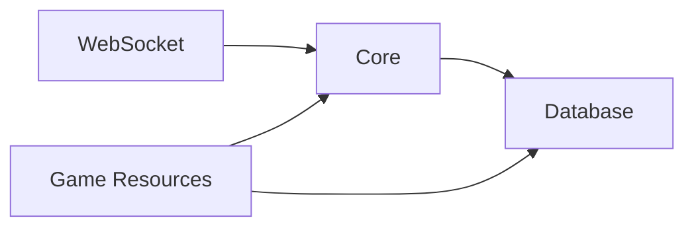
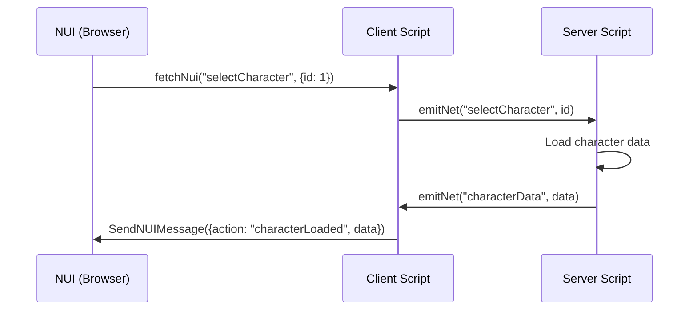
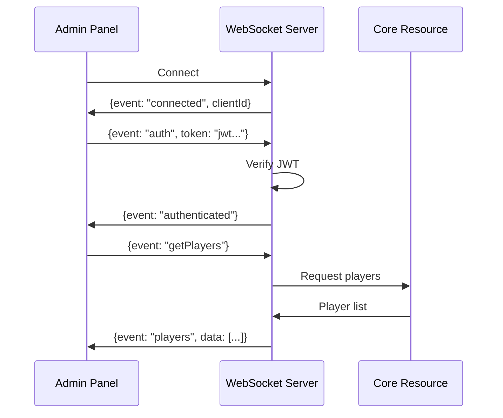
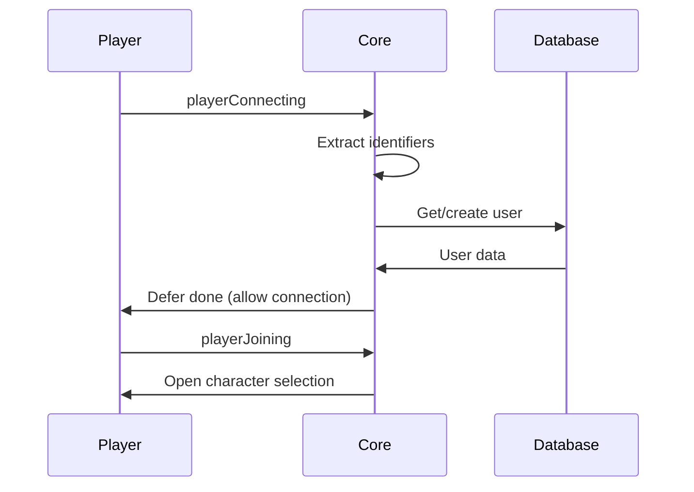
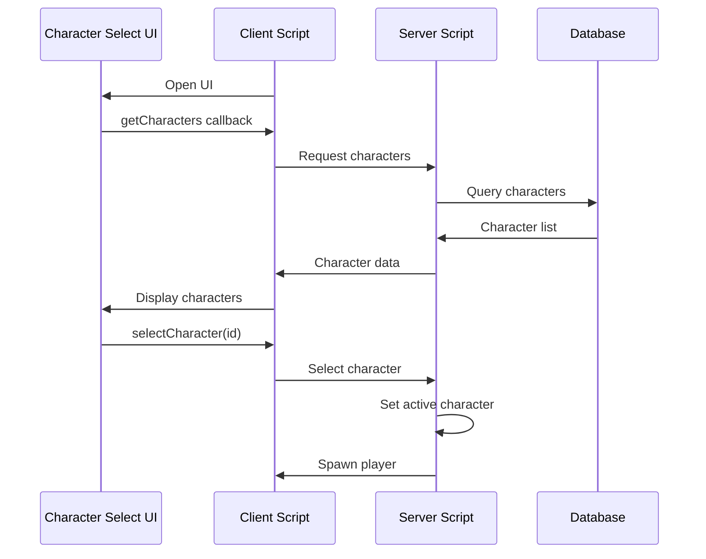
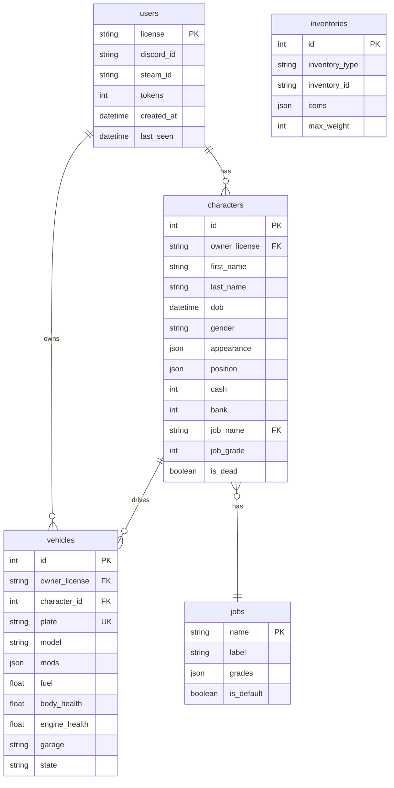
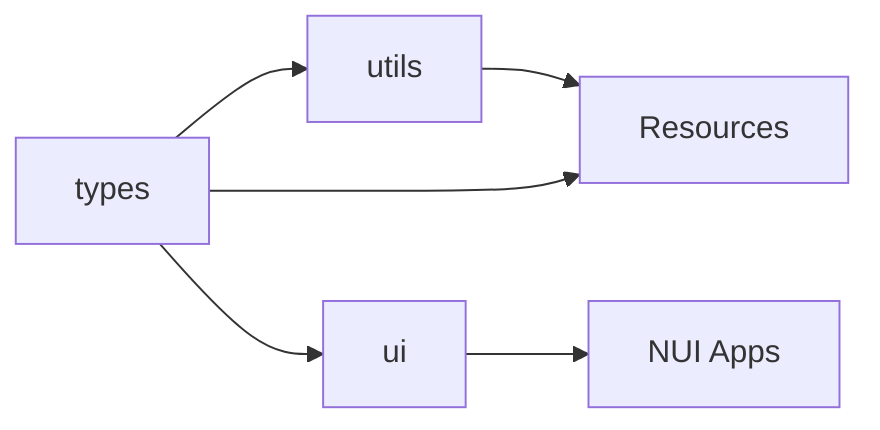

# Architecture

This document provides an overview of the framework's architecture, including the monorepo structure, communication patterns, and data flow.

## Monorepo Structure

The framework uses a pnpm workspace monorepo with the following structure:

```
├── packages/           # Shared internal packages
│   ├── types/          # @framework/types
│   ├── utils/          # @framework/utils
│   └── ui/             # @framework/ui
│
├── resources/          # FiveM resources
│   ├── [core]/         # Core framework
│   ├── [database]/     # Database layer
│   ├── [websocket]/    # WebSocket server
│   └── ...             # Game resources
│
├── apps/               # External applications
│   └── admin-panel/    # Web admin dashboard
│
└── scripts/            # Build scripts
```

## System Overview



## Layer Architecture

### 1. Packages Layer

Shared code used across resources and apps:

| Package | Purpose |
|---------|---------|
| `@framework/types` | TypeScript interfaces, Zod schemas, event names |
| `@framework/utils` | Math, validation, formatting, random utilities |
| `@framework/ui` | SolidJS components and hooks for NUI |

### 2. Core Resources Layer

Foundation resources that other resources depend on:



- **[core]**: Player management, permissions, exports for other resources
- **[database]**: Drizzle ORM, schema, query functions
- **[websocket]**: External communication via WebSocket

### 3. Game Resources Layer

Feature resources that implement game functionality:

- Character selection/creation
- Inventory management
- Job system
- Vehicle ownership

### 4. Apps Layer

External applications that communicate via WebSocket:

- Admin Panel (React + TypeScript)

## Communication Patterns

### Client ↔ Server Events

FiveM native events for client-server communication:

```typescript
// Client → Server
emitNet("framework:selectCharacter", characterId);

// Server → Client
emitNet("framework:spawnCharacter", source, characterData);

// Server → All Clients
emitNet("framework:playerJoined", -1, playerData);
```

### NUI ↔ Client Communication

NUI (browser) communicates with Lua/JS client via callbacks:



### Resource Exports

Resources expose functions for other resources to use:

```typescript
// In [core] resource
exports("getPlayer", (source: number) => playerManager.getPlayer(source));

// In another resource
const player = exports["[core]"].getPlayer(source);
```

### WebSocket Communication

External apps connect via WebSocket with JWT authentication:



## Data Flow

### Player Connection Flow



### Character Selection Flow



## Database Schema

Entity relationship diagram:



## Build System

The framework uses Turbo for monorepo builds:

```bash
# Build all packages and resources
pnpm build

# Watch mode for development
pnpm build:watch

# Build specific resource
pnpm --filter character-selection build
```

### Build Pipeline



Packages are built first, then resources can import from them.

## Technology Stack

| Layer | Technology |
|-------|------------|
| Server Scripts | TypeScript (esbuild) |
| Client Scripts | TypeScript (esbuild) |
| Database | PlanetScale (MySQL) + Drizzle ORM |
| NUI Framework | SolidJS |
| NUI Styling | Tailwind CSS |
| Admin Panel | React + Vite |
| WebSocket | ws (Node.js) |
| Auth | JWT |
| Build | Turbo + esbuild |
| Package Manager | pnpm |
