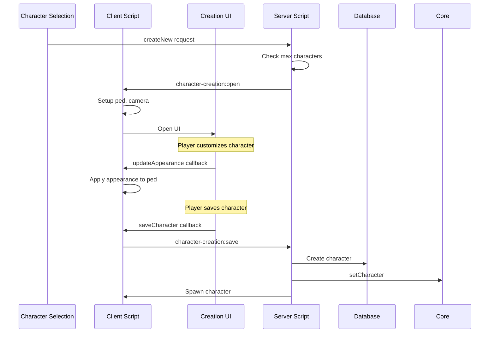

# Character Creation Resource

The `character-creation` resource provides the UI and logic for players to create new characters with customizable appearances.

## Overview

Features:

- Full character customization UI
- Ped model selection (male/female freemode)
- Facial features and head blend
- Hair, facial hair, makeup
- Clothing and accessories
- Real-time preview
- Form validation

## Flow



## Server Events

### Incoming Events

#### character-creation:save

Save the new character.

```typescript
onNet("character-creation:save", (data: CreateCharacterInput) => {
  // Validate, create in database, set as active
});
```

**Data Structure:**

```typescript
interface CreateCharacterInput {
  firstName: string;      // 2-50 chars
  lastName: string;       // 2-50 chars
  dob: string;            // YYYY-MM-DD format
  gender: "male" | "female";
  appearance: CharacterAppearance;
}
```

#### character-creation:cancel

Cancel creation and return to selection.

```typescript
onNet("character-creation:cancel", () => {
  // Return player to character selection
});
```

### Outgoing Events

#### character-creation:open

Open the creation UI.

```typescript
emitNet("character-creation:open", source);
```

#### character-creation:created

Notify that character was created successfully.

```typescript
emitNet("character-creation:created", source, characterId);
```

## Client Events

### character-creation:open

Opens the character creation UI.

```typescript
onNet("character-creation:open", () => {
  // Setup ped, camera, open NUI
});
```

## NUI Callbacks

### saveCharacter

Save the character.

```typescript
fetchNui("saveCharacter", {
  firstName: "John",
  lastName: "Doe",
  dob: "1990-01-15",
  gender: "male",
  appearance: { ... }
});
```

### cancelCharacter

Cancel and return to selection.

```typescript
fetchNui("cancelCharacter", {});
```

### updateAppearance

Update the ped appearance in real-time.

```typescript
fetchNui("updateAppearance", {
  appearance: CharacterAppearance
});
```

## Appearance Structure

The appearance object contains all ped customization data:

```typescript
interface CharacterAppearance {
  model: string;  // "mp_m_freemode_01" or "mp_f_freemode_01"
  
  // Head blend for face structure
  headBlend: {
    shapeFirst: number;   // 0-45, mother face
    shapeSecond: number;  // 0-45, father face
    shapeThird: number;   // 0-45, third influence
    skinFirst: number;    // 0-45, mother skin
    skinSecond: number;   // 0-45, father skin
    skinThird: number;    // 0-45, third skin
    shapeMix: number;     // 0.0-1.0, shape blend
    skinMix: number;      // 0.0-1.0, skin blend
    thirdMix: number;     // 0.0-1.0, third blend
  };
  
  // Facial features (-1.0 to 1.0)
  faceFeatures: number[]; // 20 features
  
  // Overlays (makeup, blemishes, etc.)
  headOverlays: {
    [index: number]: {
      index: number;      // Style index
      opacity: number;    // 0.0-1.0
      color?: number;     // Primary color
      secondColor?: number;
    }
  };
  
  // Hair colors
  hairColor: {
    primary: number;
    secondary: number;  // Highlights
  };
  
  // Eye color
  eyeColor: number;
  
  // Clothing components
  components: {
    [index: number]: {
      drawable: number;
      texture: number;
      palette?: number;
    }
  };
  
  // Props (hats, glasses, etc.)
  props: {
    [index: number]: {
      drawable: number;  // -1 for none
      texture: number;
    }
  };
}
```

## Component Indices

| Index | Component |
|-------|-----------|
| 0 | Face |
| 1 | Mask |
| 2 | Hair |
| 3 | Torso |
| 4 | Legs |
| 5 | Parachute/Bag |
| 6 | Shoes |
| 7 | Accessory |
| 8 | Undershirt |
| 9 | Kevlar |
| 10 | Badge |
| 11 | Torso 2 |

## Prop Indices

| Index | Prop |
|-------|------|
| 0 | Hat |
| 1 | Glasses |
| 2 | Ear |
| 6 | Watch |
| 7 | Bracelet |

## Head Overlay Indices

| Index | Overlay |
|-------|---------|
| 0 | Blemishes |
| 1 | Facial Hair |
| 2 | Eyebrows |
| 3 | Ageing |
| 4 | Makeup |
| 5 | Blush |
| 6 | Complexion |
| 7 | Sun Damage |
| 8 | Lipstick |
| 9 | Moles/Freckles |
| 10 | Chest Hair |
| 11 | Body Blemishes |
| 12 | Add Body Blemishes |

## Face Feature Indices

| Index | Feature |
|-------|---------|
| 0 | Nose Width |
| 1 | Nose Peak Height |
| 2 | Nose Peak Length |
| 3 | Nose Bone Height |
| 4 | Nose Peak Lowering |
| 5 | Nose Bone Twist |
| 6 | Eyebrow Height |
| 7 | Eyebrow Depth |
| 8 | Cheekbones Height |
| 9 | Cheekbones Width |
| 10 | Cheeks Width |
| 11 | Eyes Opening |
| 12 | Lips Thickness |
| 13 | Jaw Bone Width |
| 14 | Jaw Bone Depth |
| 15 | Chin Height |
| 16 | Chin Depth |
| 17 | Chin Width |
| 18 | Chin Hole Size |
| 19 | Neck Thickness |

## Validation

Character data is validated using Zod schemas:

```typescript
const CreateCharacterSchema = z.object({
  firstName: z.string().min(2).max(50),
  lastName: z.string().min(2).max(50),
  dob: z.string().regex(/^\d{4}-\d{2}-\d{2}$/),
  gender: z.enum(["male", "female"]),
  appearance: CharacterAppearanceSchema,
});
```

## Default Spawn Location

New characters spawn at the configured default location:

```lua
-- resources/[core]/config.lua
Config.DefaultSpawn = {
    x = -269.4,
    y = -955.3,
    z = 31.2,
    heading = 205.0,
}
```

## UI Implementation

The creation UI provides sliders and selectors for each customization option:

- **Info Tab**: Name, date of birth, gender
- **Heritage Tab**: Parents (face blend)
- **Features Tab**: Face feature sliders
- **Appearance Tab**: Hair, makeup, overlays
- **Clothing Tab**: Clothes and accessories

## Camera System

The creation screen positions the camera for different views:

- Full body view for clothing
- Close-up for face customization
- Rotate ped for different angles

## Customization

### Adding Default Outfits

Modify the initial appearance:

```typescript
const defaultMaleAppearance: CharacterAppearance = {
  model: "mp_m_freemode_01",
  components: {
    3: { drawable: 15, texture: 0 },  // Torso
    4: { drawable: 21, texture: 0 },  // Legs
    6: { drawable: 34, texture: 0 },  // Shoes
    8: { drawable: 15, texture: 0 },  // Undershirt
    11: { drawable: 15, texture: 0 }, // Torso 2
  },
  // ... other defaults
};
```

### Rebuilding NUI

After UI changes:

```bash
pnpm --filter character-creation build
```
