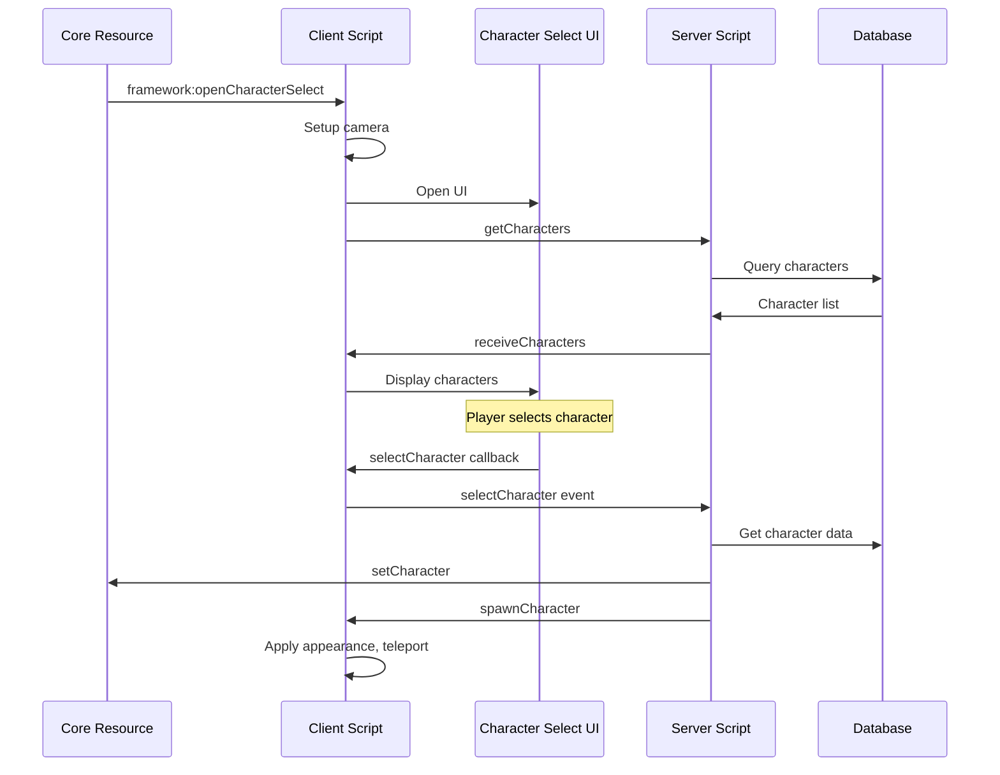

# Character Selection Resource

The `character-selection` resource provides the UI and logic for players to select, delete, or create characters after connecting to the server.

## Overview

Features:

- Character selection UI with SolidJS/NUI
- Display character cards with name, job, money
- Select character to spawn
- Delete characters
- Create new characters (opens character-creation)
- Cinematic camera during selection

## Flow



## Server Events

### Incoming Events

#### character-selection:getCharacters

Request character list for the player.

```typescript
onNet("character-selection:getCharacters", () => {
  // Server fetches characters and sends back
});
```

#### character-selection:selectCharacter

Select and spawn a character.

```typescript
onNet("character-selection:selectCharacter", (characterId: number) => {
  // Server validates, sets character, triggers spawn
});
```

#### character-selection:deleteCharacter

Delete a character.

```typescript
onNet("character-selection:deleteCharacter", (characterId: number) => {
  // Server validates ownership and deletes
});
```

#### character-selection:createNew

Request to create a new character.

```typescript
onNet("character-selection:createNew", () => {
  // Server checks max characters, opens creation UI
});
```

### Outgoing Events

#### character-selection:receiveCharacters

Send character list to client.

```typescript
emitNet("character-selection:receiveCharacters", source, {
  characters: CharacterCardData[],
  maxCharacters: number
});
```

#### character-selection:spawnCharacter

Spawn the selected character.

```typescript
emitNet("character-selection:spawnCharacter", source, {
  appearance: CharacterAppearance,
  position: { x, y, z, heading }
});
```

## Client Events

### Incoming Events

#### framework:openCharacterSelect

Opens the character selection UI (triggered by core).

```typescript
onNet("framework:openCharacterSelect", () => {
  // Open selection UI
});
```

## NUI Callbacks

Callbacks that the UI can make to the client:

### selectCharacter

Select a character to play.

```typescript
// NUI sends
fetchNui("selectCharacter", { id: characterId });
```

### deleteCharacter

Delete a character.

```typescript
fetchNui("deleteCharacter", { id: characterId });
```

### createNew

Open character creation.

```typescript
fetchNui("createNew", {});
```

## NUI Messages

Messages sent from client to NUI:

### open

Show the character selection UI.

```typescript
SendNUIMessage({ action: "open", data: {} });
```

### close

Hide the character selection UI.

```typescript
SendNUIMessage({ action: "close", data: {} });
```

### setCharacters

Provide character data to display.

```typescript
SendNUIMessage({
  action: "setCharacters",
  data: {
    characters: [
      {
        id: 1,
        firstName: "John",
        lastName: "Doe",
        job: "police",
        jobGrade: "Officer",
        cash: 5000,
        bank: 25000,
        lastPlayed: new Date()
      }
    ],
    maxCharacters: 5
  }
});
```

## Camera Setup

The selection screen uses a scripted camera:

```typescript
const CAMERA_COORDS = { x: -75.53, y: -818.96, z: 326.18 };
const CAMERA_ROT = { x: -10.0, y: 0.0, z: -90.0 };
```

This positions the camera high above the city for a cinematic view during character selection.

## Configuration

Configure in the resource or via core config:

- **Max Characters**: Maximum characters per player (default: 5)
- **Camera Position**: Adjust `CAMERA_COORDS` and `CAMERA_ROT` in client script

## UI Components

The NUI uses `@framework/ui` components:

- `Card` for character cards
- `Button` for actions
- `Modal` for delete confirmation
- `useNui` and `useNuiEvent` hooks

## Usage from Other Resources

### Trigger Character Selection

```typescript
// Force a player back to character selection
emitNet("framework:openCharacterSelect", source);
```

### Check if Player Has Character

```typescript
const character = exports["[core]"].getCharacter(source);
if (!character) {
  // Player is still in character selection
}
```

## Customization

### Changing the Background

Edit the client script to change camera position:

```typescript
// resources/character-selection/src/client/index.ts
const CAMERA_COORDS = { x: YOUR_X, y: YOUR_Y, z: YOUR_Z };
const CAMERA_ROT = { x: ROT_X, y: ROT_Y, z: ROT_Z };
```

### Modifying the UI

The NUI is in `resources/character-selection/nui/`:

```
nui/
├── src/
│   ├── App.tsx       # Main component
│   ├── index.tsx     # Entry point
│   └── index.css     # Styles
├── package.json
├── tailwind.config.js
└── vite.config.ts
```

Rebuild after changes:

```bash
pnpm --filter character-selection build
```
