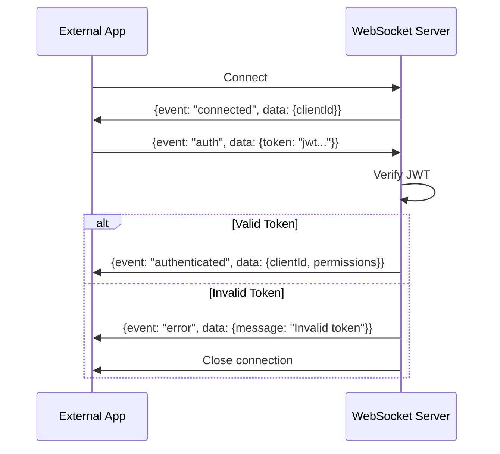

# WebSocket Resource

The `[websocket]` resource provides a WebSocket server for external applications (like the admin panel) to communicate with the FiveM server in real-time.

## Overview

Features:

- WebSocket server on configurable port
- JWT-based authentication
- Permission system
- Real-time event broadcasting
- Request/response message handling

## Configuration

Set these convars in `server.cfg`:

```cfg
set ws_port "3001"
set ws_jwt_secret "your-super-secret-key-at-least-32-characters"
```

| Convar | Description | Default |
|--------|-------------|---------|
| `ws_port` | Port for WebSocket server | 3001 |
| `ws_jwt_secret` | Secret key for JWT signing | Required |

## Authentication

### Connection Flow



### Generating Tokens

Tokens are generated server-side:

```typescript
// In a server resource
const token = exports["[websocket]"].generateToken(
  "admin-user-id",           // Subject (user identifier)
  ["admin", "players.view"], // Permissions
  "24h"                      // Expiration
);
```

### JWT Payload

```typescript
interface JWTPayload {
  sub: string;          // User identifier
  permissions: string[]; // Permission list
  iat: number;          // Issued at
  exp: number;          // Expiration
}
```

## Message Protocol

### Message Format

All messages are JSON with this structure:

```typescript
interface WSMessage {
  event: string;       // Event name
  data?: unknown;      // Event data
  requestId?: string;  // Optional for request/response matching
}
```

### Sending Messages

```javascript
// Client-side (browser)
const ws = new WebSocket("ws://localhost:3001");

ws.onopen = () => {
  // Authenticate
  ws.send(JSON.stringify({
    event: "auth",
    data: { token: "your-jwt-token" }
  }));
};

ws.onmessage = (event) => {
  const message = JSON.parse(event.data);
  console.log(message.event, message.data);
};

// Send request
ws.send(JSON.stringify({
  event: "getPlayers",
  data: {}
}));
```

## Available Events

### getPlayers

Get list of online players.

**Permission Required:** `players.view`

**Request:**

```json
{ "event": "getPlayers" }
```

**Response:**

```json
{
  "event": "players",
  "data": {
    "players": [
      {
        "source": 1,
        "name": "Player Name",
        "identifiers": {
          "license": "license:abc...",
          "discord": "discord:123..."
        },
        "character": {
          "id": 1,
          "name": "John Doe",
          "job": "Police Officer",
          "cash": 5000,
          "bank": 25000
        }
      }
    ]
  }
}
```

### getStats

Get server statistics.

**Permission Required:** `stats.view`

**Request:**

```json
{ "event": "getStats" }
```

**Response:**

```json
{
  "event": "stats",
  "data": {
    "onlinePlayers": 24,
    "maxPlayers": 64,
    "uptime": 3600
  }
}
```

### getJobs

Get all job definitions.

**Permission Required:** `jobs.view`

**Request:**

```json
{ "event": "getJobs" }
```

**Response:**

```json
{
  "event": "jobs",
  "data": {
    "jobs": [
      {
        "name": "police",
        "label": "Los Santos Police Department",
        "grades": [...]
      }
    ]
  }
}
```

### kickPlayer

Kick a player from the server.

**Permission Required:** `players.kick`

**Request:**

```json
{
  "event": "kickPlayer",
  "data": {
    "source": 5,
    "reason": "Violation of server rules"
  }
}
```

**Response:**

```json
{
  "event": "success",
  "data": { "message": "Player 5 kicked" }
}
```

### announce

Send an announcement to all players.

**Permission Required:** `announce`

**Request:**

```json
{
  "event": "announce",
  "data": {
    "message": "Server restart in 5 minutes!",
    "type": "warning"
  }
}
```

## Broadcast Events

The WebSocket server broadcasts game events to all authenticated clients:

### playerJoined

```json
{
  "event": "playerJoined",
  "data": {
    "source": 5,
    "name": "PlayerName",
    "license": "license:abc..."
  }
}
```

### playerLeft

```json
{
  "event": "playerLeft",
  "data": {
    "source": 5,
    "name": "PlayerName",
    "reason": "Disconnected"
  }
}
```

### characterSelected

```json
{
  "event": "characterSelected",
  "data": {
    "source": 5,
    "characterId": 1,
    "name": "John Doe"
  }
}
```

### playerKicked

```json
{
  "event": "playerKicked",
  "data": {
    "source": 5,
    "reason": "Rule violation"
  }
}
```

## Exports

### generateToken

Generate a JWT token for authentication.

```typescript
exports["[websocket]"].generateToken(
  sub: string,           // Subject
  permissions: string[], // Permissions
  expiresIn?: string     // Expiration (default: "24h")
): string
```

### broadcast

Broadcast a message to all authenticated clients.

```typescript
exports["[websocket]"].broadcast(event: string, data: unknown): void
```

**Example:**

```typescript
// Broadcast custom event
exports["[websocket]"].broadcast("customEvent", {
  message: "Something happened!",
  timestamp: Date.now()
});
```

### sendToClient

Send a message to a specific client.

```typescript
exports["[websocket]"].sendToClient(clientId: string, event: string, data: unknown): boolean
```

### getConnectedClients

Get list of connected client IDs.

```typescript
exports["[websocket]"].getConnectedClients(): string[]
```

## Permission List

| Permission | Description |
|------------|-------------|
| `admin` | Full access (implies all permissions) |
| `players.view` | View player list |
| `players.kick` | Kick players |
| `players.ban` | Ban players |
| `stats.view` | View server statistics |
| `jobs.view` | View jobs |
| `jobs.manage` | Modify jobs |
| `announce` | Send announcements |

## Client Implementation Example

### TypeScript/React

```typescript
import { useEffect, useState, useCallback } from 'react';

interface Player {
  source: number;
  name: string;
  character: { name: string; job: string } | null;
}

function useWebSocket(url: string, token: string) {
  const [ws, setWs] = useState<WebSocket | null>(null);
  const [connected, setConnected] = useState(false);
  const [players, setPlayers] = useState<Player[]>([]);

  useEffect(() => {
    const socket = new WebSocket(url);

    socket.onopen = () => {
      socket.send(JSON.stringify({ event: 'auth', data: { token } }));
    };

    socket.onmessage = (event) => {
      const msg = JSON.parse(event.data);
      
      switch (msg.event) {
        case 'authenticated':
          setConnected(true);
          socket.send(JSON.stringify({ event: 'getPlayers' }));
          break;
        case 'players':
          setPlayers(msg.data.players);
          break;
        case 'playerJoined':
          // Refresh player list
          socket.send(JSON.stringify({ event: 'getPlayers' }));
          break;
        case 'playerLeft':
          setPlayers(prev => prev.filter(p => p.source !== msg.data.source));
          break;
      }
    };

    socket.onclose = () => setConnected(false);
    
    setWs(socket);
    return () => socket.close();
  }, [url, token]);

  const kickPlayer = useCallback((source: number, reason: string) => {
    ws?.send(JSON.stringify({
      event: 'kickPlayer',
      data: { source, reason }
    }));
  }, [ws]);

  return { connected, players, kickPlayer };
}
```

## Security Considerations

1. **Use strong JWT secrets** - At least 32 characters, randomly generated
2. **Set appropriate token expiration** - Balance convenience vs security
3. **Validate permissions** - Always check permissions before actions
4. **Use HTTPS/WSS in production** - Encrypt traffic with SSL
5. **Firewall WebSocket port** - Only allow trusted IPs if possible
